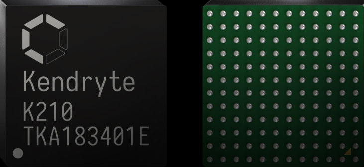

K210
=====

The Kendryte K210 is a system-on-chip (SoC) that integrates machine vision and machine hearing. Using TSMC's ultra-low-power 28nm advanced process with dual-core 64-bit processors for better power, performance, stability and reliability. The program strives for zero threshold development and can be deployed in the user's products in the shortest time, giving the product artificial intelligence.

The Kendryte K210 is located in the SoC of the AI ​​and IoT markets and is a very convenient MCU.

In Chinese, Kendryte means surveying intelligence, while surveying intelligence is taken from surveying and searching. The main application field of this chip is in the field of Internet of Things, and it is developed in the field of Internet of Things. Therefore, this chip mainly provides artificial intelligence solutions, which are explored in the field.

* Machine vision
* Machine hearing
* Better low power vision processing speed and accuracy
* With convolutional artificial neural network hardware accelerator KPU, high performance convolution artificial neural network operation
* TSMC 28nm advanced process, temperature range -40 ° C to 125 ° C, stable and reliable
* Supports firmware encryption, it is difficult to crack using common methods
* Unique programmable IO array for more flexible product design
* Low voltage, lower power consumption compared to systems with the same processing power
* 3.3V/1.8V dual voltage support, no level shifting, cost saving

## AI Solution

### Machine Vision

With machine vision capabilities, the Kendryte K210 is a zero-threshold machine vision embedded solution. It can perform convolutional neural network calculations in low power situations.

The chip can achieve the following machine vision capabilities:

* General target detection based on Convolutional Neural Network
* Image Classification based on Convolutional Neural Network
* Face detection and face recognition
* Get the size and coordinates of the detected target in real time
* Get the type of detected target in real time

### Machine hearing

The Kendryte K210 has machine hearing capabilities. The chip comes with a high-performance microphone array audio processor for real-time source orientation and beamforming.

The chip can achieve the following machine hearing capabilities:

* Sound source orientation
* Sound field imaging
* Beamforming
* Voice wake up
* Speech Recognition

### Visual/Hearing Hybrid Solution

The Kendryte K210 combines machine vision and machine hearing to provide even more powerful features. On the one hand, in the application, both the sound source localization and the sound field imaging can be used to assist the machine vision to track the target, and the general target detection can be used to obtain the target's orientation, and then the machine hearing aids the beamforming of the orientation. On the other hand, the direction of the person can be obtained by the image transmitted from the camera, so that the microphone array is directed to the person by beamforming. At the same time, the direction of a speaker can be determined according to the microphone array, and the camera is rotated to point to the person.

## Data download

* [Kendryte official website download page](https://kendryte.com/downloads/)
where there is a must-see `datasheet`

* [Kendryte Github](https://github.com/kendryte/)
